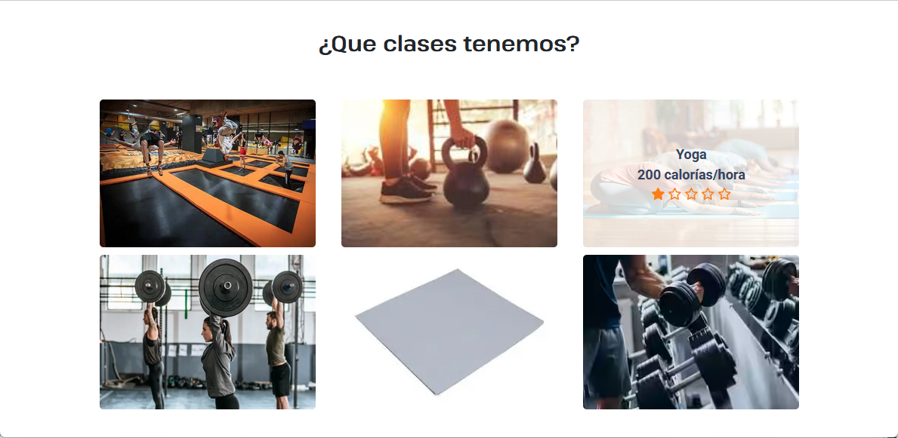
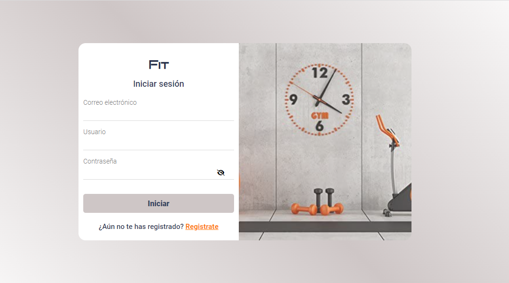

### Proyecto Final del grado DAW
###  http://fit-center.000.pe/
### Correo-APP: fitcenter2023@gmail.com 
### Seguridad: 
Implementación de un sistema de confirmación por correo electrónico en la aplicación, lo cual añade una capa adicional de seguridad al proceso de registro y __autenticación__ de usuarios. Esto ayuda a asegurar que solo usuarios legítimos puedan acceder a la plataforma, previene la creación de cuentas falsas o maliciosas, y verifica la información del usuario a través de enlaces o __códigos únicos__ en los correos de confirmación. Además, proporciona protección contra __ataques de fuerza bruta__ al agregar un paso adicional al proceso de registro
<h1><a href="#indice">Índice</a></h1>
<h1><a href="#proyecto">Proyecto</a></h1>
  <ul>
        <li><a href="#introduccion">Introducción</a></li>
        <li><a href="#requisitos-funcionales">Requisitos funcionales</a></li>
        <li><a href="#analisis">Analísis y diseño web</a></li>
        <li><a href="#base-de-datos">Base de datos</a></li>
        <li><a href="#pruebas">Pruebas</a></li>
        <li><a href="#despliegue">Despliegue</a></li>
        <li><a href="#herramientas">Herramientas</a></li>
        <li><a href="#lenguajes">Lenguajes</a></li>
        <li><a href="#sistema-base-de-datos">Sistema Base de datos</a></li>
        <li><a href="#frameworks">Frameworks</a></li>
        <li><a href="#tecnologias">Tecnologías</a></li>
        <li><a href="#librerias">Librerías</a></li>
        <li><a href="#pluggins">Pluggins</a></li>
        <li><a href="#bibliotecas">Bibliotecas</a></li>
        <li><a href="#otros">Otros</a></li>
    </ul>
   <h1><a href="#producto">Producto</a></h1>
    <ul>
        <li><a href="#accesibilidad">Accesibilidad y usabilidad</a></li>
        <li><a href="#panel-del-administrador">Panel del administrador</a></li>
        <li><a href="#parte-publica">Parte pública de la aplicación</a></li>
        <li><a href="#parte-privada">Parte privada de la aplicación</a></li>
    </ul>

  <h1><a href="#bibliografia">Bibliografía</a></h1>

<!--  finalizan los titulos -->
   

<h1 id="indice">Indice</h1>
    
<h1 id="producto">Producto</h1>
     <h3 id="introduccion">Introducción</h3>
     <ul>
     <li>a-Titulo: FIT_Center</li>
     <li>b-Logotipo: </li> 
           
     <li>c-Descripción: </li></ul>
     Este proyecto muestra todos los pasos seguidos para construir una Aplicación Web para la reserva de clases de deporte a
distancia (Online).
      Este proyecto ha sido construido puramente con:
        <ol>
          <li>Lenguajes de marcas: HTML, CSS3.</li>
          <li>Lenguajes de programación: JAVASCRIPT, PHP.</li>
          <li>Tecnologías como AJAX, JSON, jQuery.</li>
          <li>Frameworks: Bootstrap, fontawesome.</li>
        </ol>
     <h3 id="requisitos-funcionales">Requisitos funcionales</h3>
       <ul>
            <li>R1: Diseño Responsive: Las páginas web de la aplicación son todas (responsives) y adaptables con diferentes
               tamaños de dispositivos, desde la página de inicio (A landing page).</li>
            <li>R2: Control de los errores de los formularios.</li>
            <li>R3: Registro del usuario:Nombre Completo, Correo Electrónico, Contraseña, Confirmar contraseña, Usuario.</li> 
            <li>R4: Código de verificación del usuario, para que se le autorice desde el administrador de la aplicación el
        inicio de su nueva sesión, requerimientos para implementar este sistema: se enviará al usuario un correo que contiene el código de verificación, cual debe introducirlo en el campo que le aparezca de forma automática al enviar la petición de registro, para ello se utilizará la librería PHPMmailer, es una clase de PHP, que incluye un protocolo SMTP para enviar correos, la función PHPMailer(), y otras clases de PHP para controlar los errores.</li>
            <li>R5: Iniciar sesión: una vez se confirma el registro de la cuenta mediante la introducción del código enviado al
        correo electrónico del usuario, se le autoriza el inicio de sesión.</li>
            <li>R6: Requisitos funcionales dentro del Perfil del usuario: cuando la sesión ha sido iniciada exitosamente, y el
        usuario ya se encuentra en el área privada de la aplicación puede gestionar sus datos personales como:</li>
       <ul>
                  <li> R6-1: Editar su perfil (cambiar nombre, apellidos, correo ...etc.)</li>
                  <li> R6-2: Cambiar Contraseña.</li>
                  <li> R6-3: Explorar las clases con detalles, obtener informaciones sobre las clases reservadas y disponibles.</li>
                  <li> R6-4:Efectuar reservas: cuando el usuario selecciona una clase, los datos de esta clase se recopilan de forma automática, y se le imprime al usuario un formulario que contiene los datos de esta clase seleccionada, lo cual el usuario solo tiene que insertar su teléfono y correo para inscribirse en la clase seleccionada, o dispondrá de la opción de cancelar para volver a la consulta de otras clases(un usuario puede inscribirse en varias clases, siempre cuando haya plazas disponibles), este requisito contiene dos opciones principales:</li><ul>
                      <li> R-6-4-1: Si el usuario no especifica una fecha determinada, le saldrán todas las clases según la fecha del sistema(día actual)</li>
                      <li>R-6-4-2: Si el usuario pulsa el botón filtrar por clases (este botón estará disponible en la página principal del perfil del usuario, contiene un desplegable de clases y sesiones implementadas en la base de datos de la aplicación), entonces puede filtrar por la clase que quiera, y le saldrá por pantalla los detalles de la clase seleccionada disponible en ese día para cambiar la fecha y obtener datos (fecha, horario, plazas disponibles, plazas reservadas, Sala, Precio) según la fecha requerida.</li>
                      <li>R-6-4-3: Si el usuario desea buscar clases según una fecha determinada, para eso se implementó un calendario en la página web para obtener detalles de las clases según la fecha seleccionada.</li></ul>
   </ul>
            <li>R7: Cancelar reserva.</li>
            <li>R8: Traducción: la página de inicio está disponible en tres idiomas: francés, inglés y español, la funcionalidad de este requisito será realizado mediante JavaScript (la tecnología Json), y la utilización de la herramienta (API) Online: flagsapi.</li>
                   
            <li>R9: Darse de baja de la aplicación, se le solicita al usuario pulsar un botón que le parecerá en seguida para
        confirmar baja y se deriva a la página de inicio.</li>
            <li>R10: Funciones del Panel de la administración de la aplicación.</li>

</ul>
<h2 id="analisis">Analísis y diseño web</h2>
<h2 id="base-de-datos">Base de datos</h2>
 <h3>Modelo relacional</h3>
       
 <h3>Modelo entidad-relación</h3>
       
  <h2 id="pruebas">Pruebas</h2>
  <ul>
        <li>CASO PRUEBA 1: Registrar el usuario con código de verificación.</li>
        <li>CASO PRUEBA 2: Iniciar sesión.</li>
        <li>CASO PRUEBA 3: Reservar clase.</li>
        <li>CASO PRUEBA 4: Actualizar plazas disponibles y reservadas despues de confirmar la reserva.</li>
        <li>CASO PRUEBA 5: En cuanto al perfil, modificar datos personales: nombre, usuario...etc.</li>
        <li>CASO PRUEBA 6: En cuanto a las reservas, borrar una reserva o todas las reservas.</li>
        <li>CASO PRUEBA 7: Verificar que el usuario puede darse de baja el mismo desde su sesión.</li>
        <li>CASO PRUEBA 8: Configuración del panel de administración.</li>
  </ul> 
<h2 id="despliegue">Despliegue</h2>
   
Alojamiento del proyecto en la carpeta 'www' directamente, mediante clonar el repositorio desde Github, configurar el archivo de configuración del servidor apache2: 000-default.conf

<h2 id="herramientas">Herramientas</h2>
       Para la realización del proyecto se han empleado las siguientes herramientas: 
       <ul>
             <li>Visual Studio Code: ofrece varias extensiones y funcionalidades.</li>
             <li>GitHub y Git: Entre las ventajas de usar GitHub, tener acceso a nuestros repositorios desde cualquier equipo,porque están almacenados en la nube. Su interfaz permite tener acceso rápido a nuestros repositorios. Se integra con Git.Facilita el manejo y la integración de los cambios que hace cada programador del equipo</li>
              <li>Linux Server: Debian.</li>
              <li>WAMP Server: Para hacer pruebas y testing.</li>
              <li>Perpecute: Email Server Simulated, se utilizó al inicio para la prueba del envío de correos, para verificar el funcionamiento del código fuente.</li>
    </ul>
<h2 id="lenguajes">Lenguajes</h2>
<ul>
   <li>HTML: lenguaje de marcas.</li>
   <li>CSS3: es la última versión disponible del lenguaje de marcas, que nos permite crear estilos específicos para nuestras páginas, y que combinando con lenguajes como JavaScript podremos aplicar efectos especiales para interactuar con los usuarios.
   <li>PHP: lenguaje de programación a lado del servidor.</li>
   <li>JavaScript: lenguaje de programación alado del cliente.</li></ul>
<h2 id="sistema-base-de-datos">Sistema Base de datos</h2>
<h3>Sistema Base de datos</h3>
    
MySQL: es muy utilizado para proyectos y aplicaciones PHP. En MySQL hay múltiples motores de almacenamiento, lo cual es de mayor flexibilidad a los desarrolladores en cuanto al uso de las tablas.

<h2 id="frameworks">Frameworks</a></h2>
<ul>
  <li>Bootstrap: utilizar los formularios de modales de Bootstrap, que permiten alternar el foco entre dos formularios sin necesidad de cerrar el formulario inicial. El usuario puede continuar trabajando en otro lugar, en cualquier aplicación, mientras se muestra el formulario. Utilizar otras utilidades ofrecidas por esta maravillosa herramienta.</li>
        
<li>Awesome: es un framework de iconos vectoriales y estilos CSS3. Este framework es utilizado para sustituir imágenes de iconos comunes por gráficos vectoriales convertidos en fuentes. Ha sido utilizado en varias ocasiones en este proyecto, para la integración de los iconos en HTML utiliza la etiqueta 'i'.</li></ul>
<h2 id="tecnologias">Tecnologías</h2>
    <ul>
    <li>AJAX: es una tecnología que permite a una página web actualizarse de forma dinámica sin recargarse
        completamente, Ajax permite que un usuario de la aplicación web interactúe con una página web sin la interrupción que implica
        volver a cargar la página web. La interacción del sitio web ocurre rápidamente sólo con partes de la página de
       recarga.</li>
     <li>JSON: es un formato de intercambio de datos que resulta muy fácil de leer y escribir. Ha sido utilizado en la traducción de las páginas, en la mayoría de las pruebas de los ficheros con consultas de base de datos para el testing mediante la utilización de (json_encode), para imprimir con el formato de Json, nos permite el intercambio de los datos.</li>
  
   </ul>
<h2 id="librerias">Librerías</h2>
   <ul>
   <li>JQuery: es una librería perteneciente al lenguaje de programación JavaScript creada para simplificar las
      operaciones de JavaScript.</li>
   <li> Popper: librería de JavaScript, para añadir tooltips y popovers en elementos HTML. Ofrece un montón de opciones de personalización y es totalmente modular, con diferentes plugins para cada característica.</li>
   <li>Moment: la librería JavaScript para el manejo de fechas y del tiempo.</li>
   <li>PHPMailer: es una clase desarrollada en PHP que trata de facilitar las funcionalidades asociadas a los envíos y manejos de correos electrónicos.</li>
<h2 id="pluggins">Pluggins</h2>
    
Datatable de JavaScript: DataTables es un plugin para jQuery que permite agregar en las tablas de la página Web
        un aspecto liviano y las funciones para buscar, ordenar y paginar los resultados de forma rápida.
         
        FullCalendar plugin de jQuery: El plugin Fullcalendar es un plugin que se usa para mostrar calendario de
        eventos,citas o cualquier otro proyecto que requiera un calendario visual, que se pueda manipular y sea fácil de usar.
    

 <h2 id="bibliotecas">Bibliotecas</h2>
    
Typed.js: Una biblioteca de JavaScript que ayuda a crear animación de escritura. Por ejemplo,un mensaje de bienvenida para el visitante de un sitio web.

<h2 id="otros">Otros</h2>
    
GoogleFonts. AdobeColor. 

<h1 id="producto">Producto</h1>
<h3 id="accesibilidad">Accesibilidad y usabilidad</h3>
         
<h3 id="panel-del-administrador">Panel del administrador</h3>
        
<h3 id="parte-publica">Parte pública de la aplicación (muestra)</h3>
         
         
        
<h3 id="parte-privada">Parte privada de la aplicación</h3>
         
         
<h3 id="formularios">Formularios</h3>
         
<h1 id="bibliografia">Bibliografía</h1>
    <ul>
        <li><a href="https://www.w3schools.com">w3schools</a></li>
        <li><a href="http://www.php.net">php.net</a></li>
        <li>CDN: <a href="https://cdnjs.com/">cdnjs</a></li>
        <li>Ajustes de fullcalendar: <a href="https://fullcalendar.io/">fullcalendar</a>, <a href="https://fullcalendar.io/docs">Documentación</a></li>
       <li>Diagramas de base de datos: <a href="http://dia-installer.de/">Software dia</a></li>
       <li>Diagrama de planificación de tareas:<a href="https://blog.ganttpro.com/">ganttpro</a></li>
       <li>Simulador de servidor para la prueba del email de verificación (test email server), licenciado de Apache License, version 2.0: <a href="https://www.papercut.com/">papercut-SMTP</a> The Simple Desktop Email Server, para hacer la prueba del envío del  correo de  verificación.</li>
       <li><a href="https://github.com/PHPMailer/PHPMailer">PHPMailer</a></li>
       <li>Traducción:<a href="https://flagsapi.com">API-Traducción</a></li>
       <li><a href="https://www.canva.com">Herramienta para la Defensa del proyecto</a></li></ul>>
